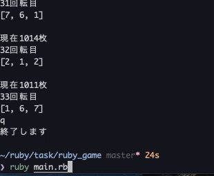

# スロットゲームの作成

## 概要

- Ruby を使ったプログラムを組み、簡単なゲームを自作できるかの検証
- 数字をランダムに取り出し、スロットゲームのような遊戯が可能かどうかの実験

## 実装した機能

- ３つの数字が同じなら当たりにする機能
  - ランダム数字の作成
  - ３つが同じ数字なら当たりを判定する処理
- 何回目で当たりが出たかわかる機能
  - 1 回毎にカウントする処理
  - 3 つの数字が同じ時にカウントを表示する機能
- １回遊ぶ毎に所持枚数が減る機能
  - １回遊ぶ毎のコストの設定
  - （現在の所持枚数）＝（所持枚数）- （１回にかかるコスト 3 枚）をする処理
  - 大当たり時に所持枚数が増える機能
    - 当たり時の報酬の設定
    - 3 つの数字が同じ時に所持枚数に報酬を加える処理
- 途中からでも所持金を引き継いで遊べる機能
- ルールの説明

## 実行の流れ

1. エンターキーでゲームを始める
2. ルール説明を聞く or 聞かないの選択肢
3. エンターキーで遊ぶ or "q"でやめるを選択
4. 現在の枚数、回転数、ランダムの数字３つが表示される
5. 3 つの数字が同じなら大当たり。所持枚数が 300 枚加算される
6. 3~6 の繰り返し
7. 遊戯終了時、メダルの所持枚数を保持する
8. 再遊戯時、前回のメダル枚数を引きついだ状態遊べる
